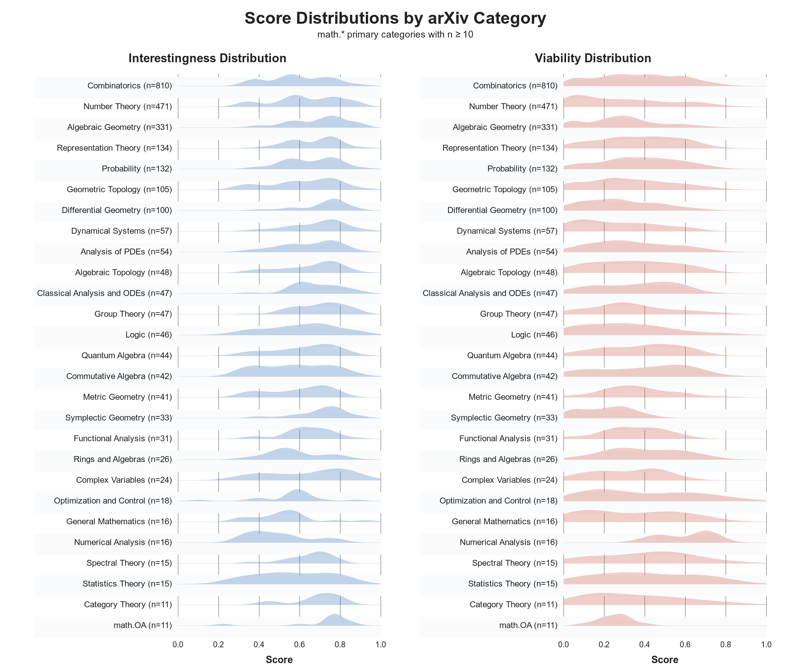

# OpenConjecture, a living dataset of mathematics conjectures from the ArXiv

OpenConjecture is a living dataset of mathematics conjectures extracted from recent arXiv papers. The pipeline in [`conjectures-arxiv`](https://github.com/davisrbr/conjectures-arxiv) ingests recent papers announced on arXiv's math page, extracts conjecture-like blocks from source LaTeX, labels each candidate with GPT-5 Mini, and scores real/open conjectures for interestingness and near-term viability.

OpenConjecture is currently composed of **3531** open conjectures.

This snapshot currently contains 4415 extracted candidate conjecture records from 26747 papers announced on arXiv's math page, with most recently ingested papers currently published between 2025-12-30 and 2026-07-09, alongside 144 older papers retained from earlier snapshots. GPT-5 Mini labeled 858 records as `not_real_conjecture` and 26 as `uncertain`. Under the current publication policy (`hf-publication-v2`), 2092 conjectures are published with text and 2323 are included as metadata-only records because their licensing is more restrictive.

The GitHub repository includes the full pipeline, scripts, plots, and solver artifacts for this release.

## Links

- Source code and pipeline: [`github.com/davisrbr/conjectures-arxiv`](https://github.com/davisrbr/conjectures-arxiv)
- Hugging Face dataset repo: `davisrbr/openconjecture`

## This release includes

- Paper metadata and the conjecture text.
- LLM labels for every conjecture in the snapshot.
- The full pipeline, scripts, plots, and solver artifacts in the source repo.

## LLM-labeled conjectures, per field

The plot below shows the category-level score density for the currently published `real_open_conjecture` subset, using the interestingness and near-term viability scores from the pipeline.

## Publication Policy

This Hugging Face release is prepared as a noncommercial dataset release, so `CC BY-NC*` material is included.

Current withhold rules:

- arXiv non-exclusive distribution license (`arxiv.org/licenses/nonexclusive-distrib/1.0/`)

When text is withheld, the record still includes the paper identifier, URLs, and source location.
This policy metadata is exposed per record in `publication_decision`, `publication_text_reason`, and `publication_policy_version`.

## Files

- `data/conjectures.jsonl`: public conjecture records with text redacted only when policy requires it
- `data/conjectures.csv`: CSV version of the public conjecture table
- `data/papers.jsonl`: paper metadata plus counts of redacted versus published conjectures per paper
- `data/papers.csv`: CSV version of the paper table
- `data/publication_manifest.json`: aggregate counts for the publication decision pipeline
